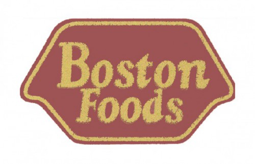
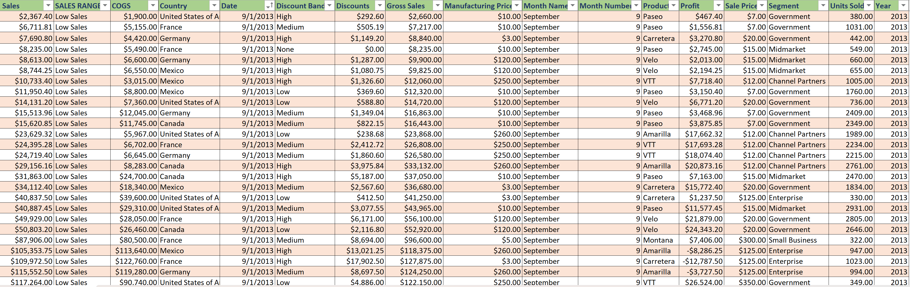
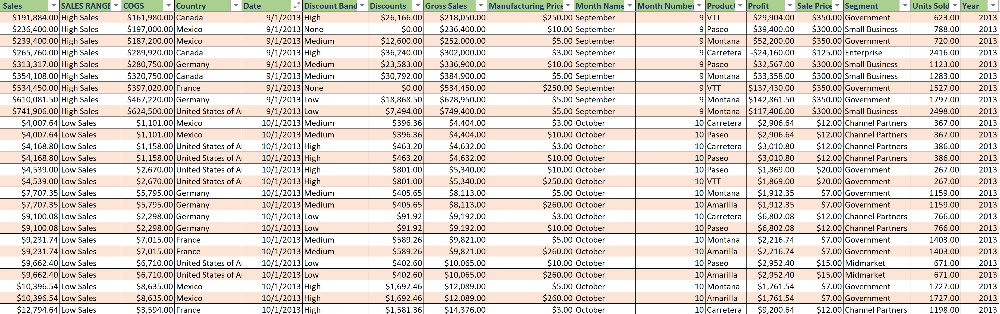
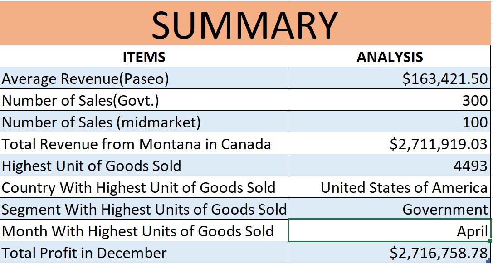

# BOSTON FOODS

## Introduction
#### The data as shown in this repository was created to analyze the performance of the BOSTON FOODS outfit through a specific period and to determine the period it had its highest sales and average profit as well as other relevant information. The data in this data set if for the period of September 2013 to December 2014.

screen 1         | screen 2
:-------------:|:--------------------:
 | 

## Features used in excel
#### Formulas and Conditional statements.

## Problem Statement
#### 1.	To determine the average revenue fro the sale if the Paseo product alone 
#### 2.	Number of transactions made in the government and Midmarket segment 
#### 3.	Total revenue generated in Canada from the sale of Montana alone
#### 4.	Highest unit of goods sold in a particular month, the country where the sales was made, the segment where it was made and also the month the sale was made.
#### 5.	To determine the total profit made in the month of December.

---
---
## ANALYSIS

### The above data shows that;
#### The product Paseo generated an average revenue of $163,421.50.
#### The number of transactions in the Government segment is 300 and that of the Midmarket is 100 which brings the total of both segments to 400.
#### The total Revenue generated from the product Montana in Canada alone is $2,711,919.03
#### In the month of April, the Government segment had the highest unit of goods sold as 4493 and the sale was made in the United States of America.
#### The total profit generated in December is $2,716,758.78
---
---

